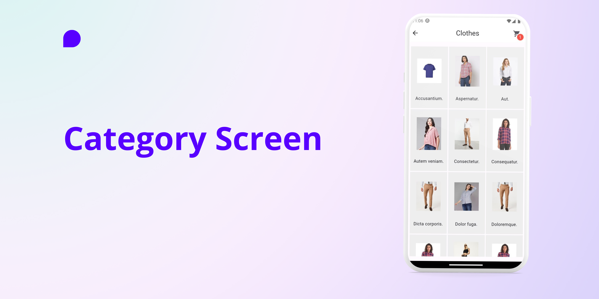
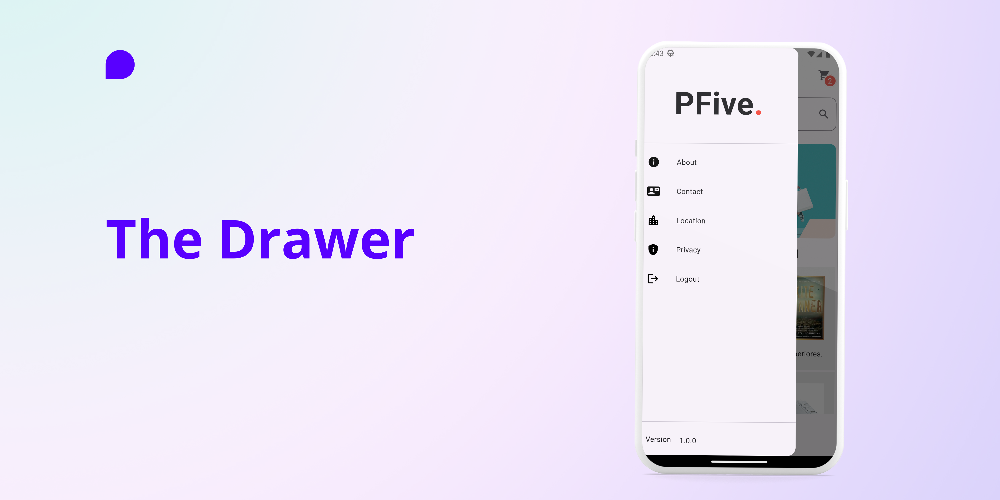
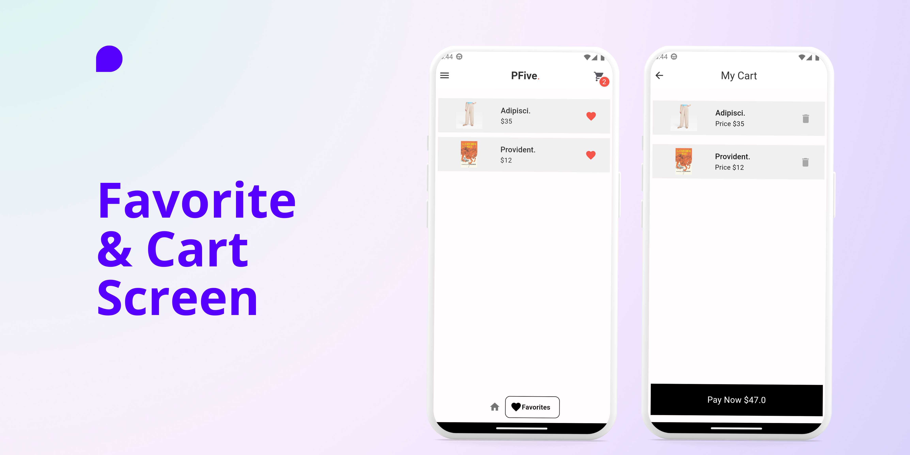

# PFive

Shopping at home is better!


### Screens








### Features

- add to cart (Provider)
- remove from cart (Provider)
- toggle favorite (Provider)
- List view builder
- APIs REST (GET)
- API from https://github.com/Re4ch-Jay/products_laravel_api (Custom API)
- Toast message
- Much more

### Pakages

- cupertino_icons: ^1.0.2
- provider: ^6.0.5
- http: ^0.13.6
- google_nav_bar: ^5.0.6
- go_router: ^8.0.5
- flutter_spinkit: ^5.2.0
- badges: ^3.1.1
- motion_toast: ^2.6.8


### Author

[Phat Panhareach](https://github.com/Re4ch-Jay/)


### Usage

```bash
# Clone this repository
$ git clone https://github.com/Re4ch-Jay/Flutter-E-commerce-Laravel-API.git

# Install dependencies
$ flutter packages get

# Run the app
$ flutter run
```